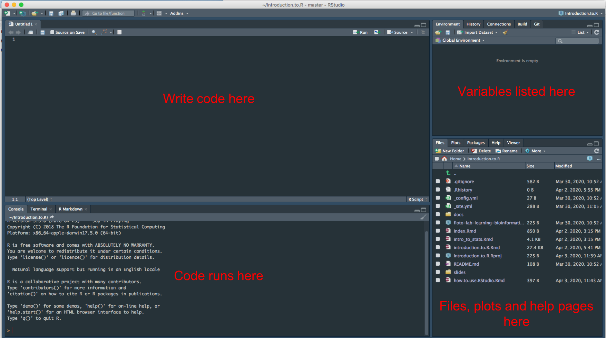
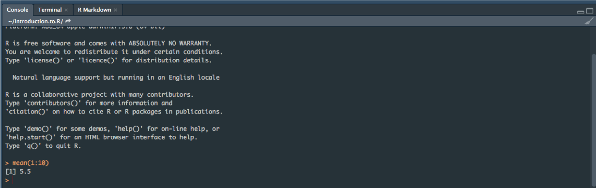
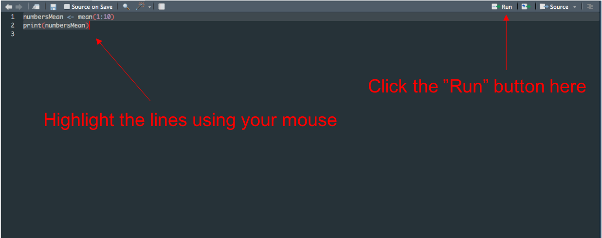
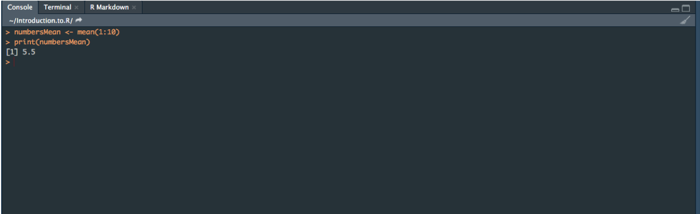
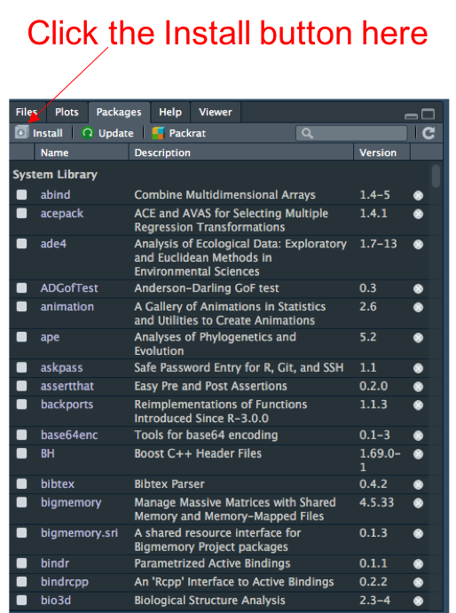
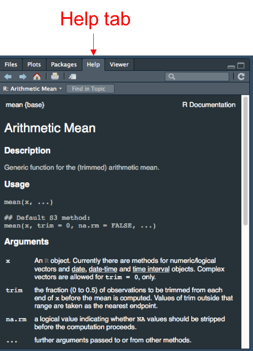

RStudio is a really useful tool for writing and running code in R. You can write your code, run your code, view tables and plots, find help pages for functions and view all of your files in here, amongst other things. In this tutorial, we'll cover how to use RStudio.

#The basic setup

RStudio consists of 4 windows. The top left window is where you write your code. The bottom left window (the Console) is where this code runs and prints any output associated with the code. The top right window shows the variables that you have created. The bottom right window shows your files, shows plots and contains the help pages.

<center>



</center>

#Creating and opening projects in RStudio

Keeping track of where you've saved your code and data can be a nightmare, as with any set of files. RStudio provides a nice way of keeping it all together through Projects. Whenever you have some data analysis you want to carry out, you can create a Project and store all of your code and data in here. You can add new scripts, data, plots and anything else you like to this Project and load these into RStudio whenever you want to do some analysis.

To create a new Project, you first need to open RStudio. Then click "File" followed by "New Project". Then click "New Directory", "New Project". Type the name of the folder you'd like the project to be saved in into "Directory name:" and then click "Create Project". RStudio will now restart. If you look in the bottom right window under the Files tab, you should see that R has created a new folder which should be in "Home > Project name". The Files tab contains all of the files and folders that are currently in the newly created Project, which will only be one currently.

If you want to close the Project, click "File" then "Close Project". Again, RStudio will restart and will now be outside of the Project folder. You can reopen the Project by clicking "File" then "Open Project" and then clicking on the Project folder (which is called whatever you named your Project) and then "Open". RStudio will now have reopened your Project folder and you should be able to see all of your files and folders in the Project in the "Files" tab in the bottom right window.

---

**Exercise**

1) Create a new Project called "Working_in_RStudio"

---

#Writing and running code in RStudio

Let's write and run some code. Type the following in the top left window:

```{r eval = FALSE}
mean(1:10)
```

This is the code that we want to run. With your cursor on the "mean(1:10)" line, type ctrl and enter. Now look at the bottom left window. You should see something that looks like this:

<center>



</center>

R has run the line of code "mean(1:10)" and has printed the output to the screen in the bottom left window. Whenever you see a line in the bottom left window that starts with ">", this is a line of code. Lines that don't start with ">" are the output from the code.

You can run multiple lines of code in one go. Type the following lines in the top left window:
```{r eval = FALSE}
numbersMean <- mean(1:10)
print(numbersMean)
```
Here, the first line creates a variable called numbersMean that contains the output from mean(1:10). In the second line, we print this variable to the screen. You have 2 options for how to run these 2 lines in RStudio. You can either type ctrl and enter on each line individually and RStudio will run the code one line at a time. However, the easiest way of running multiple lines is to highlight the lines you want to run with your mouse and then click on the "Run" button in the top right corner of the top left window:

<center>



</center>

Now looking at the bottom left window, you should see something like this:

<center>



</center>

R has run the two lines of code that we highlighted. There's no limit to the number of lines you can run in one go like this. Highlighting and clicking Run will be much more efficient than going line-by-line once you want to run tens of lines in one go.

#Writing scripts in RStudio

We now know how to write and run code in RStudio. Its good practice to save the code that you write so that you can make your results reproducible and check it later to make sure you didn't make any mistakes. You can also add bits to the code to run additional analyses, make new plots, etc. A script is a saved piece of code and we can make scripts in RStudio using the top left window.

To start a new script, click "File", "New File", "R script". You should get a new empty document appear in the top left window. We're going to write our code in the top left window and, as before, run it in the bottom left window. The only difference now is we're going to save the top left window as a script. Type the following lines in the top left window:
```{r eval = FALSE}
sumMeans <- function(x, y) { #Takes two vectors, calculates the mean of each vector and adds the means together
  xMean <- mean(x)
  yMean <- mean(y)
  summedMeans <- xMean + yMean
  print(summedMeans)}

vector1 <- c(1,3,5,7,9)
vector2 <- c(2,4,6,8,10)

sumMeans(vector1,vector2)
```

Save this as "sumMeans.R" with "File", "Save as" as you would other files. You've now created a script called sumMeans.R that contains this code. So what does the code do? We've created a function called "sumMeans" which takes 2 vectors, calculates the mean of each vector and adds these means together. We then make two vectors and then run our function on these vectors. Run these lines by highlighting them as we did above. You should see the lines appear in the bottom left window and the number 11 be printed to the screen. We've just run our script!

You can put any bit of code in scripts. Loops, conditionals, functions, plotting instructions, etc. The script is just a way of saving your code so you can come back to it later.

#Viewing variables in RStudio

One nice thing about RStudio is that you can view variables. Its a bit like having an excel spreadsheet in R. Let's make a data frame containing some data by typing the following into the top left window of RStudio and then running the line so it appears in the bottom left window:
```{r eval = FALSE}
memPotDF <- data.frame(Sample = c("Sample1","Sample2","Sample3","Sample4","Sample5"), Measurement1 = c(1.2,1.4,2.5,2.7,1.6), Measurement2 = c(1.4,1.5,2.2,2.8,1.5))
```

Now have a look in the top right window under the "Environment" tab. Under the heading "Data", you should see memPotDF. When you click on memPotDF here, the data frame is displayed in the top left window. This is a nice way of being able to see our data. You can't view all types of data using this, for example vectors aren't displayed. But its very useful for looking at data frames and data tables.

#Viewing plots in RStudio

RStudio can display plots, including those produced with ggplot2. Let's plot our memPotDF using ggplot and view it in RStudio. Type the following lines into the top left window and run them:

```{r eval = FALSE}
library(ggplot2) #We need to load the library before using it
ggplot(memPotDF, aes(x = Measurement1, y = Measurement2)) + geom_point()
```

You should see the bottom right window changes to the "Plots" tab and our plot appears. Whenever you plot something in RStudio it will appear in this window (unless you save it to a file).

#Installing packages in RStudio

Packages contain sets of functions that can be useful for particular analyses, for example DESeq2 contains functions for RNASeq analysis and ape contains functions for analysing phylogenetic trees. To use the functions within a package, you first need to install the package. There's two ways of doing this. You can either use the install.packages() function in the bottom left window:
```{r eval = FALSE}
install.packages("DESeq2") #Make sure the package name is in quotes
```

This will install the DESeq2 package. The alternative in RStudio is to use the "Packages" tab in the bottom right window. When you click on this tab, it shows you a list of the packages you currently have installed. To install a new package, click on the "Install button":

<center>

{width=250px}

</center>

Then type the package name (e.g. DESeq2) into "Packages".

#Finding help for functions in RStudio

If ever you're not sure what a function does or what input it takes, the help pages in RStudio should help you out. Say we're not sure how to use the function mean(). There's two ways of accessing the help pages. You can either use the bottom left window and type ? followed by the name of the function, here "?mean". The help page will appear in the bottom right window and contains some explanation about what the function does and what input it takes. Alternatively, you can use the Help tab in the bottom right window:

<center>

{width=250px}

</center>

This contains a search bar and you can type the name of the function in here to find the help page.