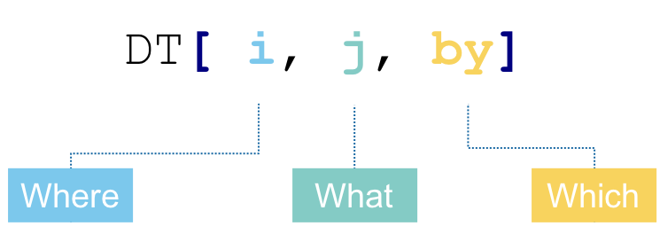

In the first R tutorial, we covered quite a broad range of coding tools in R, including creating variables, using your own and existing functions, running loops and conditional statements and reading and writing files. In this tutorial, we're going to build on that and bring in a set of additional functions that should be useful for analysing your data. Feel free to look back at the previous tutorial if you can't remember how to do things.

#Logical operators

We've already used some of these but there's a few more that are important. The logical operators are a set of symbols that we can use to determine if a particular criteria is matched. For now, we just need to know what the common ones are and what they do:

```{r eval = FALSE}

x == y #Check whether x is equal to y, make sure you put == and not just =
x != y #Check whether x does not equal y, the answer to this will be the opposite of x == y
x < y #Check whether x is less than y
x > y #Check whether x is greater than y
x <= y #Check whether x is less than or equal to y
x >= y #Check whether x is greater than or equal to y

```

Each of these logical operators gives an answer of TRUE if the condition is matched, or FALSE if the condition is not matched. We can use them to determine whether to progress with a conditional statement (see section 6 in the Introduction to R tutorial if you can't remember what one of these is) or to extract data from a table if it does, or does not, match one or more specified criteria.

---

**Exercises**

For these exercises, we're going to use this vector:
vectorOfNumbers <- c(1,2,3,4,5,6,7,8,9,10)

When we run a logical operator on a vector, R will run the logical operator on each value in the vector, so vectorOfNumbers == 5 will check whether each number in the vector equals 5 and return TRUE or FALSE for each value. To get a feeling for how the logic operators are working:

1) How many numbers in vectorOfNumbers are greater than 5
2) How many numbers in vectorOfNumbers are less than 5
3) How many numbers in vectorOfNumbers are greater than or equal to 5
4) How many numbers in vectorOfNumbers are less than or equal to 5

---

#Data tables

Data tables are similar to data frames in that they look like excel spreadsheets. You have columns and rows in the same way as you would with a data frame and you can have different types of data (e.g. numbers, sample names) in different columns. I only recently learnt that data tables existed (thanks Santi!) so am still learning about what you can do with them. But I think its fair to say that they're a bit easier to use than data frames.

Whenever you want to use data tables, you'll need to load the data tables library, as they're not a standard feature of R. So before you use them for the first time, you'll need to install the "data.tables" package (have a look in the Introduction to R or How to use RStudio tutorials if you're not sure how to do this) and you'll then need to load the library each time you want to use it. As a quick aside, if you write a script that uses data tables, you'll need to have library(data.table) at the top of that script so R will load the library when the script runs.

#Creating a data table

Ok, so how do we create a data table? Its essentially the same as creating a data frame, but using data.table instead of data.frame. We're going to create a data table of membrane potential measurements in two different ways. In the first example, we're going to write the data that's going into the data table by hand in RStudio. There's a bit more data in this example than in the previous tutorials, so writing it out by hand is a bit more time consuming. Therefore, in the second example, we're going to read in an excel spreadsheet containing the membrane potential measurements and convert that into a data table. When you have your own data, you're likely to have it in excel or as a csv or text file and so its most likely that you'll want to use the second option most of the time. To read in an excel spreadsheet, you need to have a library called readxl. Check if you already have it installed in RStudio (see section 7 in the "How to use RStudio" tutorial if you're not sure how to do this) and install it if you don't.

The spreadsheet that we want to read in is in the GitHub repository. You can either download just the spreadsheet but its a good opportunity to set up a Project in RStudio containing all of the course materials. Let's set the Project up and then run through what's in there. In RStudio, click "File" then "New Project". Then click "Version control", then "Git". In the "Repository URL:" section copy this link: https://github.com/aweimann/floto-lab-learning-bioinformatics which is the link to the Bioinformatics Course GitHub page. Into the "Project directory name:" section type whatever you want the Project to be called, e.g. Floto_lab_bioinformatics. Then click "Create Project". RStudio will restart. If you look in the Files tab in the bottom right hand window you should see a whole series of files. These are all of the files in GitHub repository. In a Project, you can save all of your code, data and plots in one place. Whenever you have a new dataset to analyse, you can create a new Project to keep everything together. Have a look in the How to use RStudio tutorial if you want to know how to create a new Project from scratch.

If you now look just below the "Console" tab in the bottom left hand window, you should see "~/Floto_lab_bioinformatics/" (or replace Floto_lab_bioinformatics with whatever you called the Project if you called it something else). This is the current working directory so is where RStudio will look for and save files by default. The spreadsheet we want to read in is in directory data and the data directory is in the directory we are currently in (see if you can see it in the bottom right hand window). Therefore to read in the spreadsheet from the directory we are currently in, we type: "read_excel(data/more_advanced_R_membrane_potential.xlsx") so R knows to look in the data directory for the file.

Let's create a data table:

```{r eval = FALSE}

library(data.table) #Remember you need to do this before you can use data tables, but you only need it once per script or per RStudio session
library(readxl) #This is the library to read in excel files, you'll need to install it if you don't already have it
exampleDT <- data.table(Cell_type = c("A","A","A","A","A","A","A","A","A","A","B","B","B","B","B","B","B","B","B","B"), Sample = c("Sample1","Sample2","Sample3","Sample4","Sample5","Sample6","Sample7","Sample8","Sample9","Sample10","Sample1","Sample2","Sample3","Sample4","Sample5","Sample6","Sample7","Sample8","Sample9","Sample10"), Measurement1 = c(1.2,1.4,2.5,2.7,1.6,2.4,2.2,1.9,1.4,1.5,2.1,2.4,2.7,2.6,3.1,1.9,2.8,2.7,2.3,2.2), Measurement2 = c(1.4,1.5,2.2,2.8,1.5,2.5,2.2,1.7,1.4,1.5,2.2,2.9,2.4,2.1,2.9,1.7,2.6,2.2,2.2,2.5)) #Creates a data table by hand, but with this amount of data its quite time consuming to write out in full
memPotDT <- data.table(read_excel("data/more_advanced_R_membrane_potential.xlsx")) #Imports our excel spreadsheet and converts it into a data table. Assumes you have created a Project with the GitHub data and are in the home directory of that Project (the one with a directory called data in it)

```

The function read_excel does exactly what it says on the tin. By default, read_excel doesn't import the data as a data table, so we therefore need to put data.table around the import command to turn the data into a data table. We assign the data we've imported to an object called memPotDT. Try the same import command but without the "memPotDT <- " part. You should see that RStudio just prints the imported data to the screen. By assigning it to an object, we can refer to that object to use the data later in our script or RStudio session. Print the data tables exampleDT and memPotDT to the screen so we can have a look at them. They should be the same. In this (made up) example, we've taken membrane potential measurements from two cell types, A and B. We've got 10 independent experiments using each cell type and we've measured the membrane potential twice in each experiment. We ran 5 experiments with each cell type on each of 2 different days. Therefore in our data table, we've got 10 rows for each cell type and two measurements in each row. In our data table, column 1 is the cell type, column 2 is the experiment number within that cell type, columns 3 and 4 are the measurements and column 5 is the day that experiment was carried out.

Now we've imported our data, let's explore it!

#Sorting tables

Let's first look at the range of values we have for the membrane potential measurements. While all of the measurements are in the data table, it will be easier to look at the range of values we have if we sort the columns. You can sort data in a data table just as you can in excel. We need to pick the column(s) to sort the data on. The way we do that with a data table is putting the column name(s) inside square brackets. Let's sort the membrane potential table by measurement 1:

```{r eval = FALSE}

memPotDT[order(Measurement1)]

```

We put the square brackets after the name of our data table so R knows we want to do something with this object. Within the square brackets, we tell R what we want to do and which column we want to use to do it. So here, we want to order the data table and we want to use the column called Measurement1 to do that. If you look at the output from this line of code, you should see that column Measurement1 starts with its smallest value (1.2) and ascends to its largest value (3.1). R has also changed the order of the other columns to keep the rows together. So we can see from this that the 6 smallest measurments in Measurement1 are from cell type A, while the 4 largest measurements are from cell type B.

---

**Exercises**

4) Sort memPotDT by column Measurement2 - does it look like cell type A also has the smallest values here?

---

We've sorted the data table by Measurement1 in ascending order. We can also sort in descending order by putting a minus sign before the column name:

```{r eval = FALSE}

memPotDT[order(-Measurement1)]

```

You should see that the data table is sorted in descending order by the value in Measurement1. In these examples, we've sorted based on numerical data so we sort from smallest to largest or from largest to smallest. We can also sort on character data (what our brains recognise as letters, words, and sentences). The columns Cell_type and Replicate contain character data.

---

**Exercises**

5) Sort memPotDT by column Replicate in ascending and descending order

---

You should see that R has sorted memPotDT in alphabetical order. If we were going to sort the Replicate column in our heads, we'd probably do it a bit differently to R. We'd probably put the 2 "Sample1"'s first, followed by the 2 "Sample2"'s, then the "Sample3"'s and so on. But you can see that R has put the 2 "Sample10"'s straight after the "Sample1"'s. This is because R doesn't recognise numbers within text. It treats each character as a letter. So if you had "Sample100" in this column as well, that would follow "Sample1" and "Sample10" but be ahead of "Sample2". This is something to keep in mind when sorting based on character data.

We can also sort on multiple columns. As an example, let's sort the data table on the Measurement1 values but keep cell types A and B apart:

```{r eval = FALSE}

memPotDT[order(Cell_type, Measurement1)]

```

If you look in column Cell_type, you can see that the ten cell type A rows have been kept together as have the ten cell type B rows. But we've sorted within cell type A so the Measurment1 values are in ascending order, and likewise within cell type B. The order in which we put the column names in this command matters. R will sort on the first column name first, and then on the second, then the third, etc. So memPotDT[order(Cell_type, Measurement1)] gives a different result to memPotDT[order(Measurement1,Cell_type)].

---

**Exercises**

6) Sort memPotDT by cell type in ascending order and then by Measurement 2 in descending order

---

#Filtering tables

Filtering a table to keep only rows that match a particular criteria can be very useful. For example, you can select all of the genes with a significant p-value or all of your experimental replicates with a measurement above a given value. This is where the operators we covered at the start of the tutorial come in very handy. As with sorting, we can filter our data table based on the values in one or more columns. We again use square brackets to specify the column we want to filter and the criteria we want values in the column to match. Here's some examples:

```{r eval = FALSE}

memPotDT[Cell_type == "A"] #Filter memPotDT to keep only the rows with Cell_type equal to A, remember the quotes around A as its a character value
memPotDT[Replicate %in% c("Sample1","Sample2")] #Filter memPotDT to keep only the rows with Replicate equal to Sample2 or Sample10
memPotDT[Replicate %like% "Sample1"] #Filter memPotDT to keep only the rows whose Replicate contains "Sample1"
memPotDT[Measurement1 > 2.5] #Filter memPotDT to keep only the rows whose Measurement1 is greater than 2.5
memPotDT[Measurement1 > 2.5 & Measurement2 > 2.5] #Filter memPotDT to keep only the rows whose Measurement1 and Measurement2 are greater than 2.5
memPotDT[Measurement1 > 2.5 | Measurement2 > 2.5] #Filter memPotDT to keep only the rows whose Measurement1 or Measurement2 is greater than 2.5

```

To filter based on a column, we put the column name in the square brackets followed by some criteria we want to match. In the first example, we filter on Cell_type and only keep rows if their Cell_type is A. Remember, this needs to match exactly so if the Cell_type was listed as "A1", it would not match exactly and the row wouldn't be kept.

In the second example, we keep rows whose Replicate value is either "Sample1" or "Sample2". We use "%in%" to specify that we want the left hand side (here Replicate) to be one of the values on the right hand side (here "Sample1" or "Sample2"). So we check whether the Replicate is either Sample1 or Sample2 and keep the row if it is. If the Replicate has any other value we don't keep the row. The Replicate needs to match one of the values on the right hand side exactly. You can put as many values in the vector on the right hand side of the "%in%" as you want.

The third example uses "%like%" to filter our data table. Like will keep any rows whose value specified on the left hand side contains what is specified on the right hand side. So here, we keep any row whose Replicate contains "Sample1". This therefore matches "Sample1" and "Sample10" (and would also match values with any text at the front or end of "Sample1", e.g. "ThisIsSample1" and "Sample12345" would be matched). "%like%" is often very useful to filter data if you complicated sample names and you want to pick a subset out.

Example 4 filters based on column Measurement1 and keeps the row if its Measurement1 is greater than 2.5. We can also include multiple criteria and specify that we either want all of these criteria to be met or that we want at least one of these criteria to be met in order to keep the row. In R, if we want criteria 1 AND criteria 2 to be met, we use the "&" symbol. If we want criteria 1 OR criteria 2 to be met, we use the "|" symbol. So in example 5, we keep rows if they have Measurement1 AND Measurement2 both greater than 2.5. While in example 6, we keep rows if they have Measurement1 OR Measurement2 greater than 2.5. We've just combined 2 criteria here, but you can use as many as you like as long as you can keep track of exactly what you're specifying! For example, try this:

```{r eval = FALSE}

memPotDT[Cell_type == "A" & ((Measurement1 > 2.5 & Measurement2 > 2.5) | (Measurement1 < 2.0 & Measurement2 < 2.0))]

```

This is a bit more complicated as we have nested criteria to be matched. The overall effect of this line of code is to extract rows from memPotDT if they have Cell_type A and both of the Measurments are greater than 2.5 or both of their measurements are less than 2.0. You should see 7 rows printed when you run this command in RStudio. R will return rows only if the overall outcome of the square brackets is true. The overall outcome of the square brackets is determined by each of the components within the square brackets. We've made these components quite complicated here so let's break down this example. The first thing is that when we have "(" and ")", R determines whether the outcome of the code within those brackets is true. So in our example, we've got two small pairs of brackets - "(Measurement1 > 2.5 & Measurement2 > 2.5)" and "(Measurement1 < 2.0 & Measurement2 < 2.0)". R checks whether the conditions within each of these brackets is true. For the first set of brackets, it will be true if both Measurement1 and Measurement2 are greater than 2.5. While the second set will be true if both Measurement1 and Measurement2 are less than 2.0. We then join these two pairs of brackets in another pair of brackets and using "|". Remember that "|" means or. Therefore this larger pair of brackets will be true if either of the two smaller pairs of brackets is true. So the overall impact of this larger pair of brackets is to keep rows if:

* Measurement1 and Measurement2 are both greater than 2.5

OR

* Measurement1 and Measurement2 are both less than 2.0

So the right hand side of our line of code (after the ""A" &" bit) will be true if either of these criteria are met. We also specify that we want Cell_type A only so keep rows if they have Cell_type "A" and match one of the criteria on the right hand side. There's 7 rows in our data table that match these criteria. This filtering command is about as complicated as you're ever likely to want to use, and might be more complicated than any you'd want to use! If you can follow what this command has done, you should be well set to filter your data however you'd like. The key things to remember are than you can use "&" and "|" to combine criteria and use "(" and ")" to combine multiple sets of criteria.

---

**Exercises**

7) Filter memPotDT to keep rows from Replicate Sample1, Sample3, Sample5, Sample7 and Sample9
8) Filter memPotDT to keep rows from Cell_type A that are from Replicate Sample1 or Sample2
9) Filter memPotDT to keep cells from Cell_type B with Measurement1 greater than 2.5
10) Use filter to count the number of Replicate samples from each cell type than have Measurement1 greater than 2.5

---

#Splitting a data table into groups and doing things with these groups

One really useful aspect of data tables is that they make it easy to perform calculations on specific subsets of your data. For example, you can compare the mean measurement between two sets of experiments. The way we do this is using the following format:

<center>

{width=500px}

</center>

What does this mean? The way of reading it is we take DT (our data table), we subset/reorder the rows in DT using some conditions we specify in i, we then calculate one or more things that we specify in j, while grouping our data table by what we specify in by. We're not going to consider the i part here. But we're going to look at some different useful things we can calculate in the j part while grouping our data with the by part.

Let's start off with an example using memPotDT to see how the above format works:

```{r eval = FALSE}

memPotDT[, .(M1_mean = mean(Measurement1)), by = Cell_type]

```

You should see a new data table printed to the screen with 2 columns and 2 rows. We've specified that we want to do something with memPotDT by putting the square brackets after it. We then use commas to split the square brackets into the 3 parts in the picture above. Here, we haven't put anything in front of the first comma which means we don't want to subset or reorder it. In the middle section between the 2 columns, we say what we want to do. Here, we want to calculate the mean of the values in column Measurement1. By adding ".( M1_mean = " and the corresponding ")", we say that we want to call the column in the output M1_mean. You can change the name of the column by changing the name here. The "by = Cell_type" part says that we want to calculate the mean of each Cell_type separately. R will determine what the unique values in the Cell_type column are and then calculate the mean of the Measurement1's in the rows with each Cell_type separately.

So it looks like the mean of the measurement1 values is higher in cell type B than cell type A. We can also split our data into groups based on multiple columns. Let's calculate the mean of Measurement1 in the different cell types in experiments carried out on different days:

```{r eval = FALSE}

memPotDT[, .(M1_mean = mean(Measurement1)), by = .(Cell_type, Day_of_experiment)]

```

Again, we don't have anything before the first comma as we don't want to subset or reorder our data. We keep the middle part the same as we want to calculate the mean as we did before. But we change the third part by adding in two columns to group the data by. R will split the data into all of the combinations of these columns (i.e. A and 1, A and 2, B and 1, B and 2) and calculate the mean for each of the combinations. So our output table now has 4 rows as there are 4 combinations. It also has 3 columns as R outputs the 2 columns used to split the data and the mean of each combination.

We can assign the output from these data table calulations to a new object. However, if we want to keep all of our data in a single table, we can add a new column to the data table containing our calculated mean values:

```{r eval = FALSE}

memPotDT[, M1_mean := mean(Measurement1), by = .(Cell_type, Day_of_experiment)]

```

If you print memPotDT to the screen, you should see that it now has an additional column called M1_mean. The value that a row has in this column is determined by the values in the Cell_type and Day_of_experiment columns. If the row is Cell_type A and Day_of_experiment 1, it is given the mean Measurement1 value of the rows with Cell_type A and Day_of_experiment 1. It is also possible to create multiple new columns in a single line of code:

```{r eval = FALSE}

memPotDT[, c("M1_mean", "M2_mean") := .(mean(Measurement1), mean(Measurement2)), by = .(Cell_type, Day_of_experiment)]

```

This creates 2 new columns called M1_mean and M2_mean that contain the mean of Measurement1 and mean of Measurement2, respectively, for the corresponding value of Cell_type and Day_of_experiment.

---

**Exercises**

We're going to do the same things as in the examples above but using median instead of mean.

11) Which Cell_type has the higher median value of Measurement1? What about Measurement2?
12) Calculate the median of each group splitting on Cell_type and Day_of_experiment. Is there one cell type that has a greater median on each experiment day or is this dependent on the day of the experiment?
13) Create 2 new columns in your data table containing the median values of Measurement1 and Measurement2 for the Cell_type and Day_of_experiment of the row.

---

#Merging tables

You might find yourself in a situation where you've got two sets of samples and you've taken different measurements of those samples. It could be the same thing measured multiple times or you may have measured different things. And you'd like to combine your data into a single table. You can copy and paste your columns in excel and try to check that you've matched them all up correctly but there's a chance that you might make a mistake. R has a function called merge that makes it easy to merge tables that share one or more column headers.

In the data directory you should find a second spreadsheet called membrane_potential_2.xlsx. It contains an additional 2 measurements of the membrane potential of each sample. Let's read that into RStudio and also read in the original membrane potential spreadsheet again as we've made changes to it above:

```{r eval = FALSE}

memPotDT <-  data.table(read_excel("more_advanced_R_membrane_potential.xlsx")) #Imports our excel spreadsheet and converts it into a data table
memPotDT2 <- data.table(read_excel("membrane_potential_2.xlsx"))

```

If you print these 2 data tables to the screen, you can see that they share 2 columns: Cell_type and Replicate. We can merge the data tables to get all 4 measurements in the same row using:

```{r eval = FALSE}

merge(memPotDT, memPotDT2, by = c("Cell_type", "Replicate"))

```

We give merge the two data tables we want to merge, in this case memPotDT and memPotDT2. Using "by", we say which columns we want to use to merge. So here, we merge the rows in the different data tables if they have the same value in Cell_type and Replicate. You should see that the resulting data table now has 7 columns including all 4 measurements.